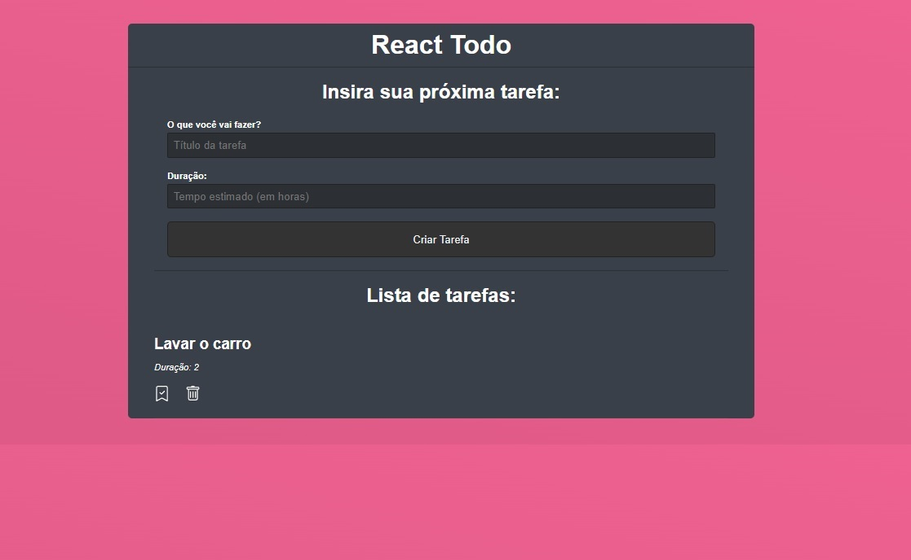

<p align="center">
    
</p>

<br>

## 💻 Project

React Todo is an online system dedicated to the streamlined registration and management of tasks. Its primary objective is to facilitate the tracking of daily activities by providing an intuitive platform for creating checklists and recording task completion.

## 🧪 Development

This project was developed using:

- [React](https://reactjs.org)
- [JSON Server](https://github.com/typicode/json-server)
- [React Icons](https://github.com/react-icons/react-icons#readme)

#### Installing
```bash
# To install all dependencies
$ npm install
```

## 🚀 Running

To start the project, execute the following commands:

#### Back End
```bash
# To start the server
$ npm run server
```

#### Front End

> Open a new terminal

```bash
# To start the project
$ npm start
```
The app will be available on the browser by accessing the address http://localhost:3000.